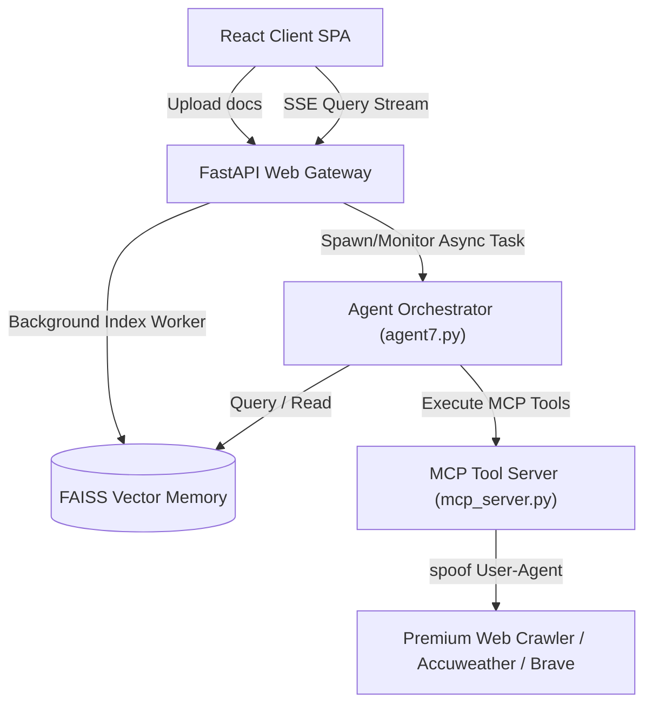

# Intellecta RAG Dashboard (Amber Edition)

Intellecta Amber is a highly resilient, Apple-inspired React SPA that modernizes document ingestion and cognitive multi-agent search. It implements advanced non-blocking ingestion pipelines, proactive temporal tool-based reasoning, and full-stack SSE stream termination workflows to deliver a state-of-the-art user control interface.

---

## 🌟 Key Modernizations & Features

### 1. Apple-Inspired Responsive SPA Canvas
*   **Vibrant Aesthetics:** Sleek glassmorphism, curated color palettes, professional typography, and subtle micro-animations.
*   **Responsive Ingestion Indicator:** Live syncing badges pulse actively while files are indexed in the background, ensuring zero UI lockup.

### 2. Non-Blocking Background Ingestion
*   Multi-threaded background worker indexes documents asynchronously via sliding-window extraction and persists them to a FAISS vector repository.
*   The landing page and query execution bars remain interactive during ingestion, featuring dynamic upload progress indicators.

### 3. Proactive Temporal & Semantic Reasoning
*   **Pure Tool-Based Time Awareness:** System prompts leverage the MCP `get_time` tool dynamically when relative time references (e.g., *"Saturday's weather"*, *"this weekend"*) are detected—guaranteeing 100% factual precision without model date hallucinations.
*   **Strict Constraint Satisfaction:** Generic, topic-agnostic instructions force the decision LLM to systematically address all sub-questions, filter criteria, and conditions prior to completing a search cycle.

### 4. Full-Stack Query Abort & Stop Workflow
*   **SSE Disconnect Detection:** The FastAPI backend actively monitors `request.is_disconnected()` on the event generator and instantly halts background agent search loops when disconnected.
*   **Live Terminate Button:** The Workspace interface features a prominent **Stop Query** action that closes client EventSources immediately.
*   **Workspace Wiping:** Navigating back to the Landing Page automatically shuts down any running query streams and cleanly wipes all state variables (query input, logs, synthesis outputs), preparing the workspace for the next clean investigation.

---

## ⚙️ System Architecture



---

## 🚀 Getting Started

### 1. Install Dependencies & Sourcing Environment
Configure your Python virtual environment and activate it:
```bash
# Source the environment
source .venv/bin/activate
```

### 2. Set Up API Credentials
Create or update your `.env` file in the root workspace:
```env
GEMINI_API_KEY="your-gemini-api-key-here"
```

### 3. Start the Web Server
Run the Uvicorn reload server:
```bash
python -m uvicorn app:app --reload --port 8000
```

### 4. Launch the App
Open your web browser and navigate to:
👉 **`http://127.0.0.1:8000/`**
